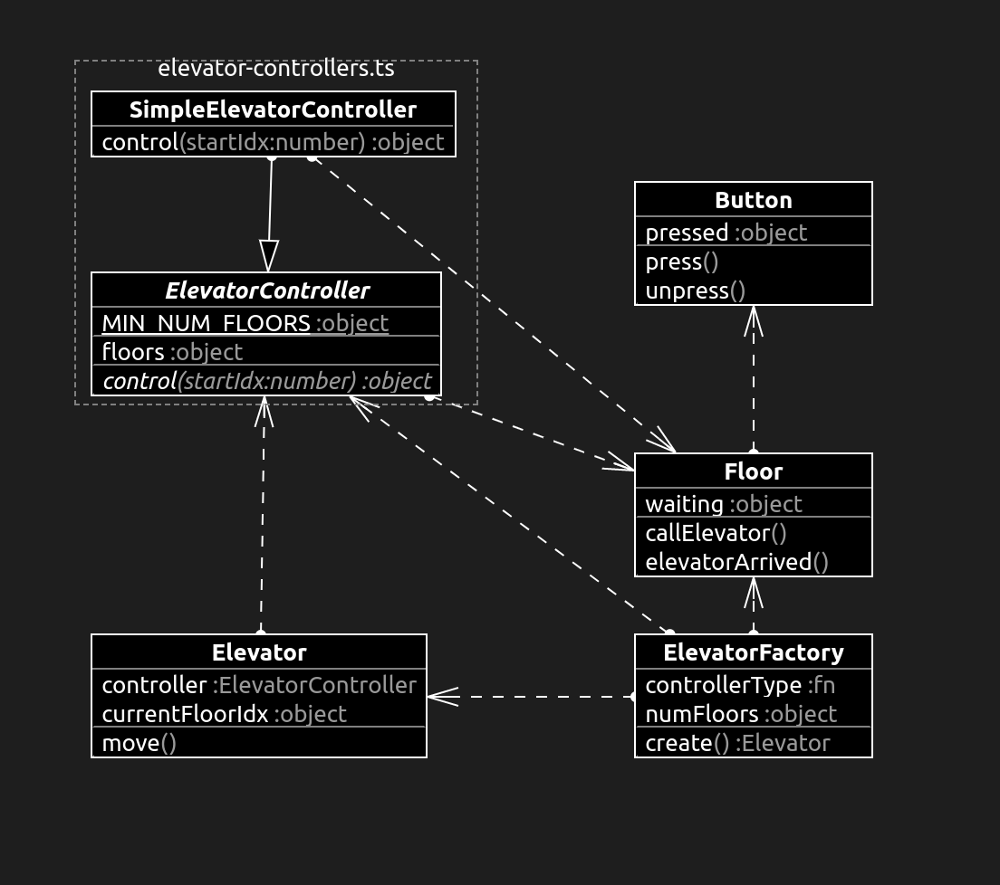

# ts-elevator

A simple elevator model written in [TypeScript](https://www.typescriptlang.org/).

## Prerequisites

The project is developed with [Node.js](https://nodejs.org/en/) (node) and managed by the node packet manager (npm).
You need to have node and npm installed to execute the commands in the following subsections
(node installations usually come with npm included).
Alternatively, if you have [Docker](https://www.docker.com/) installed,
you can also use the [node Docker image](https://hub.docker.com/_/node/).

As for all npm projects, the starting point for all project configuration is *package.json*.
The sections *Linting*, *Testing*, and *Building* below are derived from the `scripts` section of that file.

## Installing Dependencies

Before running any of the commands in the following subsections, you need to install the dependencies of the project.
This is done by executing `npm install` (docker: `docker run node npm install`).
The dependencies to install are specified in the `dependencies` and `devDependencies` keys in *package.json*.
Exact versions and dependencies of dependencies are stored in *package-lock.json*.
Running the command creates the directory *node_modules*, where all dependencies are installed to.

## Linting

The project uses [ESLint](https://eslint.org/) for [linting](https://en.wikipedia.org/wiki/Lint_%28software%29).
Configuration can be found in the file *.eslintrc.json*.

Run `npm run lint` (docker: `docker run node npm run lint`) to execute the linter.

## Testing

The project uses the [Mocha testing framework](https://mochajs.org/) and
the [Chai assertion library](https://www.chaijs.com/) for testing.
Additionally, [istanbul](https://istanbul.js.org/) is used to generate
[coverage reports](https://en.wikipedia.org/wiki/Code_coverage).
Configuration is located in *.mocharc.json* and *.nycrc*.
Tests are written following principles of
[behavioral testing](https://en.wikipedia.org/wiki/Behavior-driven_development) and are located in the *spec* directory.

To execute the tests, run `npm run test` (docker: `docker run node npm run test`).
After execution, you can find the test results in [JUnit](https://en.wikipedia.org/wiki/JUnit)
[XML](https://en.wikipedia.org/wiki/XML) format in the file *test-results.xml*.
A summary of the code coverage report is printed to the console, and a more detailed
[HTML](https://en.wikipedia.org/wiki/HTML) report is placed in the directory *coverage*.

## Building

The build configuration is specified in *tsconfig.json*.

You can build the project by running `npm run build` (Docker: `docker run node npm run build`)
from the project directory.
This creates a new directory *lib* (cf. *package.json* `files` key) which contains
the compiled JavaScript (*\*.js*) files with type annotations (*\*.d.ts*) and
source-maps (between ts/js, *\*.map*).
